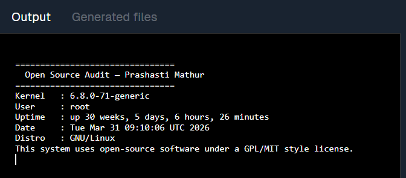
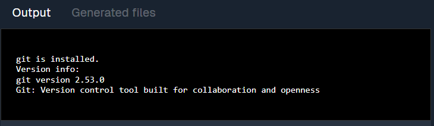
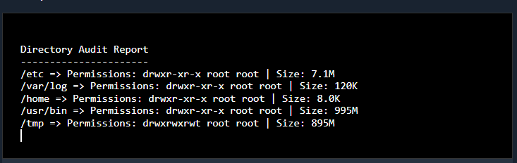
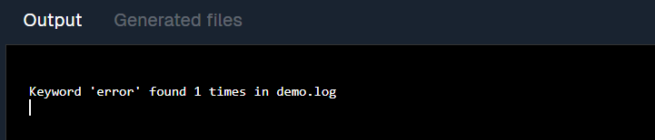
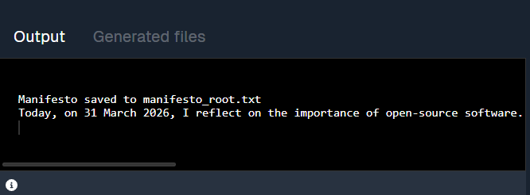
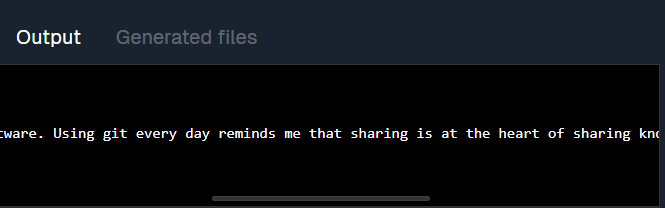
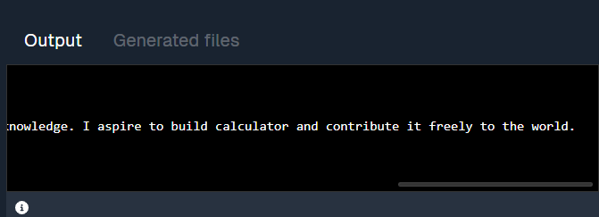

# Open Source Software Audit – Python

## Student Details

**Name:** PRASHASTI MATHUR
**Registration Number:** [24BSA10170]


## Project Overview

This project is an Open Source Software (OSS) audit of Python. It analyzes Python as an open source project, including its origin, license, ethical aspects, Linux usage, and ecosystem.


## Objectives

* To understand open source software concepts
* To study Python’s origin and development
* To analyze Python’s license and ethics
* To explore Python usage in Linux systems
* To perform practical tasks using shell scripts


## About Python

Python is a popular open source programming language created by Guido van Rossum. It is known for its simplicity, readability, and wide range of applications such as web development, data science, and automation.


## Shell Scripts Included

### 1. System Information Script

Displays system details like OS, user, kernel version, and uptime.

### 2. Python Package Checker

Checks whether Python is installed and displays its version.

### 3. Disk Usage and Permissions

Shows disk usage and file permissions of important directories.

### 4. Log File Analyzer

Analyzes a log file and counts specific keywords.

### 5. Manifesto Generator

Generates a simple text file based on user input.


## How to Run Scripts

Open Linux terminal and run:

```bash
chmod +x script1.sh
./script1.sh

chmod +x script2.sh
./script2.sh

chmod +x script3.sh
./script3.sh

chmod +x script4.sh
./script4.sh /var/log/syslog error

chmod +x script5.sh
./script5.sh
```


## Requirements

* Linux (Ubuntu / WSL)
* Bash shell


## GitHub Repository

[Paste your repository link here]

## Screenshots

### Script 1 Output


### Script 2 Output


### Script 3 Output


### Script 4 Output


### Script 5 Output





## Conclusion

This project helped in understanding how open source software works in real-world systems. Python’s flexibility and strong community make it a powerful open source tool.
